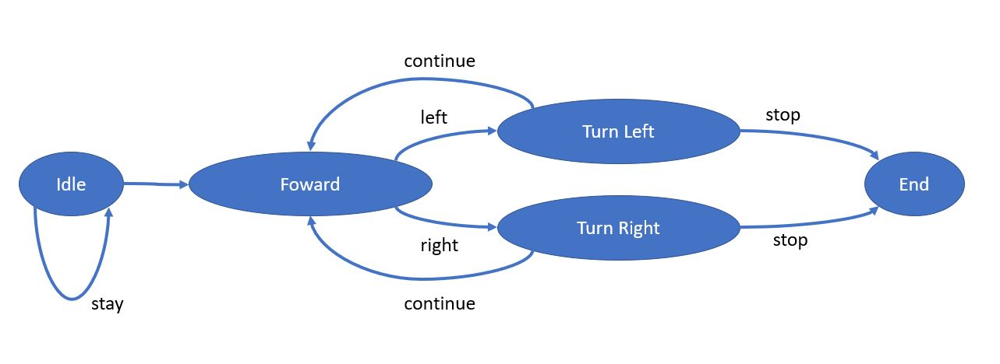

# DartV3 Challenge 2022 - Groupe DART-BP

## Auteurs
- BELLOT Victor <victor.bellot@ensta-bretagne.org> (Promotion ENSTA Bretagne 2024 - Spécialité Robotique Autonome)
- PILON Martin <martin.pilon@ensta-bretagne.org> (Promotion ENSTA Bretagne 2024 - Spécialité Robotique Autonome)

## Description
Avec ce projet, nous découvrons la collaboration avec GitLab ainsi que l'utilisation de la librairie Python DARTv2.
Nous allons ensuite expérimenter le passage de la commande d'un robot dans une simulation à celle dans un circuit réel.
Nous pouvons voir le robot Dart avec notre programme en action avec le lien :
* https://www.ensta-bretagne.fr/zerr/filerepo/dartv2/video-2022-2023/eval-20221212/ 
* cam94-grp11-2022-12-..>	2022-12-15 08:47 	14M	 

## Sommaire
1. [Structure](#structure-du-git)
    1. [Dossié py](#dossier-py)
    2. [Dossier scenes](#dossier-scenes)
    3. [Dossier vDartV2](#dossier-vdartv2)
    4. [.gitignore](#gitignore)
    5. [README.md](#readmemd)
2. [Informations Générales](#informations-générales)
    1. [Etat du projet](#etat-du-projet)
    2. [Travail effectué](#travail-effectué)
    3. [Journal de bord](#journal-de-bord)
    4. [Travail en cours](#travail-en-cours)
3. [Guide d'utilisation](#guide-dutilisation)

## Structure du Git
Le Git à deux branches principales : 
* main
Cette branche sera updaté de manière discontinue avec avec des programmes qui fonctionne
* development
La branche development sera la branche où nous ferons coderons et développerons 

Le Git est composé de plusieurs fichier et dossier :

### Dossier py
Dossier composé des différents programmes fait pour les questions du TP et du dossier drivers composé des fonctions de bases du système DART. Le travail effectué sera dans ce dossier
### Dossier scenes
Dossier avec la scène pour le logiciel de simulation V-REP
### Dossier vDartV2
Dossier avec i2csim.py le chanal de communication et vSimVar.py 
### .gitignore
Liste des fichiers qui ne va pas être push par gitlab
### README.md
README décrivant le projet GitLab 

## Informations Générales
### Etat du projet

Fini

### Travail effectué

#### Partie 1 Découverte du projet et des fonctions proposé 
Scéance 1 à scéance 4
Lors de ces scéances nous nous sommes orientés vers la compréhension du fonctionnement des différents drivers, afin de pouvoir les utilisés au cours du projet.
#### Partie 2 Utilisation des fonctions du projet pour accomplir le parcour V-REP
Scéance 5 à scéance 6  

Nous avons crée un final state machine (FSM) pour challenge dart 2020 dont le graphe est représenté ci-dessous

Plus précisément nous avons un conteur que nous initialison à 12 dans init et à chaque rotation il diminue de 1. Quand il arrive à 0 Turn fait la commande stop
Un capteur avant qui mesure une distance permet de déterminer quand le dart passe de forward a turn, lorsque que le capteur perçoit une distance inférieur à une distance fixé. Nous utilisons un filtre pour supprimer les valeurs aberrantes. Les capteurs sur les cotés vont permettre de savoir si le dart tourne left or right. Après l'application du même type de filtre que le filtre avant, si le capteur ne retourne rien alors c'est qu'il n'y a pas de mur et qu'il faut tourner dans cette direction.  

Pour l'asservissement nous utilisons la boussole pour un suivi de cap et avoir des rotations précises. Nous faisons donc une callibration afin d'initialisé la boussole.

#### Partie 3 Utilisation des fonctions du projet pour accomplir le parcour réel

### Journal de bord

* Séance 1:
    * Création d'un groupe DART-BP avec BELLOT Victor et PILON Martin.
    * Création d'un GitLab 
    * Instalation de V-REP
    * Lancé le programme de la première question pour essayer V-REP. Il fonctionne sur le premier ordinateur, mais pas sur le second. 
    * Essai GitLab (push/pull/commit)  
.         
* Séance 2:
    * Nous avons fait les questions de 1 à 5. Le programme a été écrit mais nous avons fait quelques modifications, résoluts quelques problèmes. Nous l'avons push dans la branche development
    * Nous avons essayé de téléchargé Unbuntu sur le second pc avec l'aide de M. Le-Bars. Celà a conclue sur le fait qu'il vaudrait mieux faire des sauvegardes du pc avant de continué le téléchargement     
.    
* Séance 3:
    * Nous avons continué les question de 6 à 7
    * Ecriture du README  
.        
* Entre Séances:
    * Mise en forme du README  
.     
* Séance 4:
    * Nous avons fini les question 8 et 9.
    * Compréhension de la FSM (Finite State Machine)
    * Création d'une classe robot regroupant toute les fonctions nécessaire au fonctionement du DART
    * Ecriture du README
.
* Entre Séances:
    * Création du fsm_b&f.py et du txt associé
    * Création du fsm_dart_challenge_2020.py et du txt associé
    * Modification du fsm_full_turn.py
    * Modification de la classe dartv2b 
.              
* Scéance 5:
    * Ecriture des méthodes de dartv2b
    * Rajout d'une boussole pour le dartv2 afin d'avoir des rotations précises 
    * Rajout d'une phase callibration de la boussole
    * Ecriture du README   
.
* Entre Séances:
    * Mise en place d'un asservissement en cap grâce à une boussole interne       
.     
* Séance 6:
    * Rajout d'un filtre sur les capteurs 
    * Ecriture du README   
.        
* Séance 7:
    * Création d'une fonction callibration rapide pour la boussole
    * De-bugage 
    * Rajout d'un ajustement avec les murs 

* Séance 8:
    * Callibration des différentes constante du DartV2

* Séance 9-10-11:
    * Finition des constantes
.
### Travail en cours

Actuellement sur la modification des constantes du DartV2

## Guide d'utilisation

Si il y a un argument en executant pour le programme fsm_dart_challenge_2020, alors celui-ci se lance pour la simulation. Si il n'y a pas d'argument ce programme se lance pour le Dart réel.
Pour le cas le Dart réel :
* LANCER fast_heading_calibration.py à l'extérieur  du parcour
* METTRE le robot sur la zone de départ
* LANCER fsm_dart_challenge_2020.py 

Les constantes pouvent être changé, ils sont écris dans les classes Dartv2.
